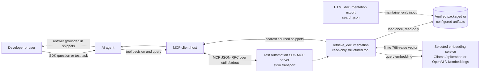
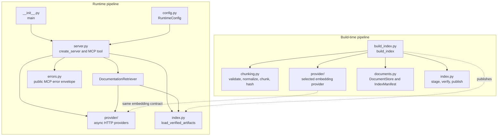
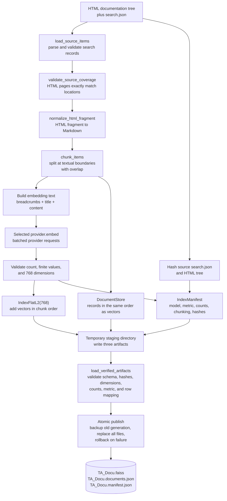
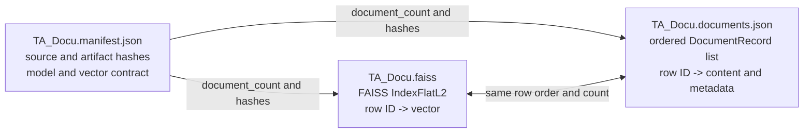
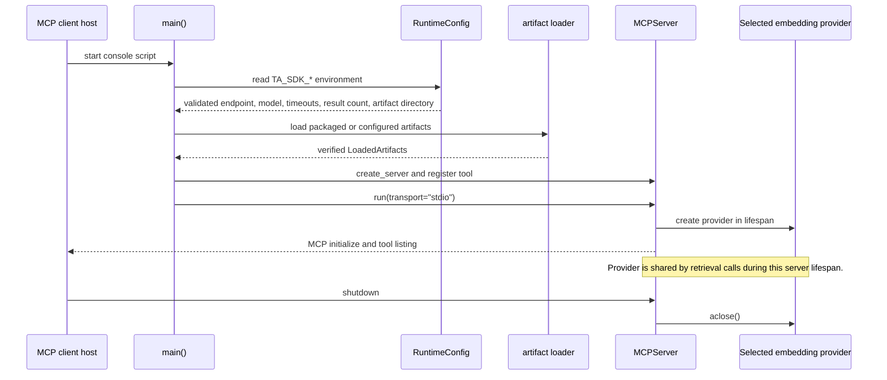
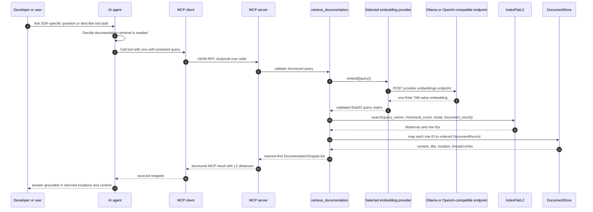

# Test Automation SDK MCP Architecture

This document describes the implementation of the Test Automation SDK MCP
server. The server is a read-only, retrieval-augmented documentation service:
it exposes one MCP tool, `retrieve_documentation`, and uses a selected Ollama
or OpenAI-compatible embedding endpoint to turn both indexed documentation and
incoming queries into vectors.

The index is built ahead of time. Server startup loads and verifies the
published artifacts; it does not crawl the documentation or rebuild the index.

## System Context

The MCP client is typically hosted by an AI agent. The agent decides when the
SDK-specific tool is needed, while the MCP server performs only deterministic
documentation retrieval. The selected embedding service supplies vectors but
does not generate the answer returned to the user.

### Runtime responsibilities

| Boundary                       | Responsibility                                                                                                             |
| ------------------------------ | -------------------------------------------------------------------------------------------------------------------------- |
| MCP client host                | Starts the console entry point and forwards MCP requests from the agent.                                                   |
| `test_automation_sdk_mcp.main` | Creates the server, configures stderr logging, and runs MCP over stdio.                                                    |
| `create_server`                | Loads verified artifacts, checks provider/model compatibility, registers the tool, and owns the provider lifecycle.        |
| `DocumentationRetriever`       | Validates a query, requests its embedding, searches FAISS, validates rows and distances, and maps rows to documents.       |
| `provider/`                    | Selects Ollama or OpenAI-compatible transport, validates wire boundaries, and translates failures into application errors. |
| FAISS `IndexFlatL2`            | Stores the document embeddings and returns nearest row IDs with L2 distances.                                              |
| `DocumentStore`                | Stores the ordered metadata and content records that correspond to FAISS row IDs.                                          |

## Package Structure

The build and runtime paths share the embedding dimension and provider contract,
but they have different jobs. The builder creates artifacts; the runtime only
loads, validates, checks compatibility, and queries them.

## Building the Index

The source directory must contain an HTML tree and `search.json`. The builder
requires exact page coverage between those inputs, converts search records from
HTML fragments to normalized Markdown, and chunks each section using stable
character limits and overlap. Each chunk retains its source location, title,
breadcrumbs, tags, and chunk index.

### Build steps

1. `load_source_items` parses `search.json` and checks that every indexed page
	exists in the HTML tree and every HTML page is represented.
2. `chunk_items` normalizes each section and produces deterministic chunk IDs
	from location, chunk index, and content. The default maximum is 1,000
	characters with 200 characters of overlap.
3. `_embed_chunks` sends embedding text to the selected provider in batches.
	The default batch size is 32. Every response must contain one finite vector
	of exactly 768 values per input.
4. FAISS receives vectors in the same order as the `DocumentStore` records.
	This order is the row-ID contract used during retrieval.
5. The builder writes the FAISS index, document JSON, and manifest in a
	temporary directory, reloads them through the normal verification path, and
	publishes the complete generation together. A failed publication restores
	the previous generation.

## Published Artifact Contract

One index generation consists of three files:

At runtime, `load_verified_artifacts` rejects missing files, invalid JSON or
schemas, hash mismatches, mixed generations, wrong FAISS dimensions, wrong
metrics, and count mismatches. The configured provider must equal the manifest
provider before the MCP server is created. Ollama always requires an exact
model match; a configured OpenAI model requires an exact non-null match, while
an unconfigured OpenAI model is explicit operator trust mode.

## Server Startup and Lifespan

The default artifact directory is the package's `db/` resource directory. A
filesystem directory can be selected with `TA_SDK_DB_DIR`. The runtime never
uses the current working directory to discover packaged artifacts.

## Retrieval and Agent Tool Invocation

The agent should call the tool for authoritative Test Automation SDK questions
and SDK-based Python test development. Generic Python questions and unrelated
dSPACE products are outside this server's intended scope.

### Retrieval details

1. The query must be a string, non-empty after trimming, and no longer than
	4,000 characters.
2. The provider validates the returned shape as `(1, 768)` and rejects
	non-finite values.
3. The result count is bounded by the configured value, the number of FAISS
	vectors, and the number of document records. It defaults to 5 and is capped
	at 50 by configuration.
4. FAISS searches with the L2 metric. Results are sorted nearest-first by
	distance, and every row ID is checked before it is used as a document index.
5. The tool returns `content`, `location`, `title`, `breadcrumbs`, and the
	uncalibrated non-negative L2 `distance` for each snippet. It does not call a
	chat model and does not synthesize the final answer.

## Error and Trust Boundaries

The server validates data at each external boundary: environment variables,
source files, provider requests and responses, FAISS results, artifact files, and
MCP tool output. Expected application failures are translated to a safe native
MCP error with a code, classification, and retryability flag.

| Boundary            | Examples                                                | Runtime behavior                                                                 |
| ------------------- | ------------------------------------------------------- | -------------------------------------------------------------------------------- |
| Query input         | Empty, non-string, or oversized query                   | `invalid_query`; permanent and not retryable.                                    |
| Provider connection | Timeout or unavailable endpoint                         | Transient embedding error; retry may be appropriate with bounded backoff.        |
| Provider response   | Wrong model, indexes, vector count, dimension, or value | `embedding_response_invalid`; permanent until the service contract is corrected. |
| FAISS/artifacts     | Invalid index, row ID, distance, hash, count, or schema | Retrieval or artifact failure; the server does not serve unverified data.        |
| MCP output          | Invalid snippet fields or distance                      | `tool_output_invalid`; the response is rejected rather than returned partially.  |

Secrets such as `TA_SDK_OLLAMA_API_KEY` and `TA_SDK_OPENAI_API_KEY` are used
only as HTTP bearer tokens and are not included in logs or public error messages.
Protocol messages stay
on stdout; human-readable logging and startup errors go to stderr so stdio MCP
traffic remains parseable.

## Configuration Surface

| Variable                    | Default                  | Used by                                       |
| --------------------------- | ------------------------ | --------------------------------------------- |
| `TA_SDK_EMBEDDING_PROVIDER` | `ollama`                 | Selects `ollama` or `openai`.                 |
| `TA_SDK_OLLAMA_URL`         | `http://127.0.0.1:11434` | Ollama base URL; `/api/embed` is appended.    |
| `TA_SDK_OLLAMA_MODEL`       | `nomic-embed-text:v1.5`  | Required Ollama model binding.                |
| `TA_SDK_OLLAMA_API_KEY`     | unset                    | Optional Ollama bearer token.                 |
| `TA_SDK_OPENAI_URL`         | unset                    | Complete `/v1/embeddings` endpoint.           |
| `TA_SDK_OPENAI_MODEL`       | unset                    | Optional exact OpenAI model binding.          |
| `TA_SDK_OPENAI_API_KEY`     | unset                    | Optional OpenAI bearer token.                 |
| `TA_SDK_RESULT_COUNT`       | `5`                      | Maximum nearest snippets, from 1 through 50.  |
| `TA_SDK_DB_DIR`             | packaged `db/`           | Alternate fully validated artifact directory. |
| `TA_SDK_CONNECT_TIMEOUT`    | `5` seconds              | HTTP connection timeout.                      |
| `TA_SDK_REQUEST_TIMEOUT`    | `30` seconds             | HTTP request timeout.                         |

## Source Map

- `src/test_automation_sdk_mcp/__init__.py`: console entry point and stdio
  process lifecycle.
- `src/test_automation_sdk_mcp/server.py`: MCP server construction, tool
  schema, retrieval orchestration, and structured output.
- `src/test_automation_sdk_mcp/build_index.py`: source-to-artifact build and
  atomic publication.
- `src/test_automation_sdk_mcp/chunking.py`: source validation, HTML
  normalization, chunking, and source hashes.
- `src/test_automation_sdk_mcp/provider/`: shared embedding contract, Ollama
	and OpenAI-compatible transports, and the provider factory.
- `src/test_automation_sdk_mcp/ollama.py`: compatibility imports for the
	legacy Ollama provider module.
- `src/test_automation_sdk_mcp/index.py`: artifact I/O and cross-file
  generation validation.
- `src/test_automation_sdk_mcp/documents.py`: strict document and manifest
  models.
- `src/test_automation_sdk_mcp/config.py`: environment configuration and
  validation.
- `src/test_automation_sdk_mcp/errors.py`: safe application-to-MCP error
  translation.
